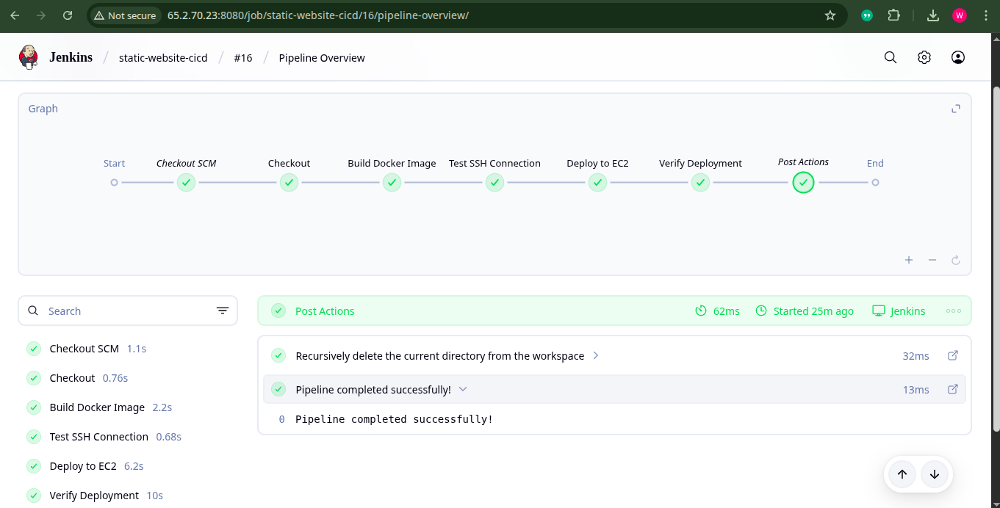
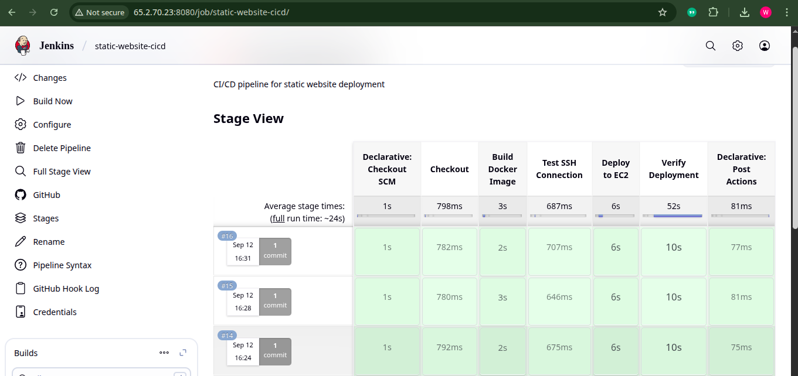
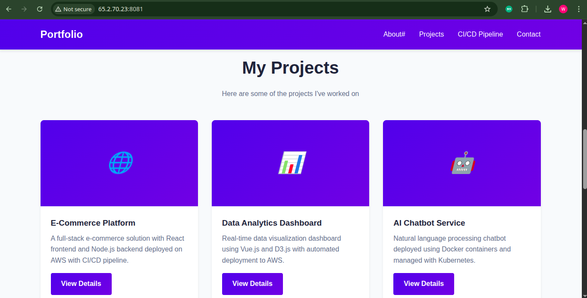
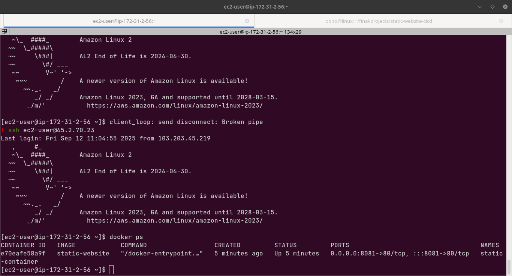

# Static Website CI/CD Deployment with Terraform

This project demonstrates a complete CI/CD pipeline for deploying a static website to AWS EC2 using Docker, Jenkins, Nginx, and Terraform for Infrastructure as Code.

## Architecture

- **Infrastructure as Code**: Terraform
- **Source Code**: GitHub repository
- **CI/CD Server**: Jenkins on AWS EC2
- **Containerization**: Docker
- **Web Server**: Nginx
- **Deployment Target**: AWS EC2 (Free Tier)

## Terraform Management

### Initialize Terraform

```bash
terraform init

```

# Static Website CI/CD Deployment with Terraform and Jenkins

This project demonstrates a complete CI/CD pipeline for deploying a static website to AWS EC2 using Docker, Jenkins, Nginx, and Terraform for Infrastructure as Code.

## Architecture

- **Infrastructure as Code**: Terraform
- **Source Code**: GitHub repository
- **CI/CD Server**: Jenkins on AWS EC2
- **Containerization**: Docker
- **Web Server**: Nginx
- **Deployment Target**: AWS EC2 (Free Tier)
- **Automation**: GitHub Webhooks

## Pipeline Workflow

1. Code is pushed to GitHub
2. GitHub webhook triggers Jenkins pipeline
3. Jenkins checks out the code
4. Tests are run to validate the code
5. Docker image is built
6. Image is deployed to EC2 instance
7. Deployment is verified

## 🛠️ Tools & Technologies

- **Jenkins** – CI/CD automation server
- **Git & GitHub** – Version control & source code repository
- **Maven** – Build tool for Java application
- **Docker** – Containerization of the application
- **AWS EC2** – Deployment server (Amazon Linux)
- **scp/ssh** – Secure deployment to EC2

## ⚙️ Steps Implemented

### 1️⃣ Jenkins Setup

- Installed Jenkins on EC2
- Configured required plugins (`Git`, `Docker`, `Pipeline`)
- Added GitHub credentials & SSH keys

### 2️⃣ Docker Integration

- Created a **Dockerfile** for application containerization
- Jenkins pipeline builds & tags Docker images automatically
- Images pushed to **private Docker Hub repository**

### 3️⃣ Deployment to AWS EC2

- Configured Jenkins to connect to EC2 using **ssh/scp**
- Stopped any existing container running on the same port
- Deployed new container on **port 8081**

---

## 📂 Project Structure

├── app
│   ├── Dockerfile
│   └── index.html
├── infrastructure
│   ├── main.tf
│   ├── outputs.tf
│   ├── terraform.tfstate
│   ├── terraform.tfstate.backup
│   └── variables.tf
├── Jenkinsfile
└── README.md

### Manual Trigger

1. Push changes to GitHub
2. Jenkins automatically builds and deploys

### Manual Deployment

````bash
# Build the Docker image
docker build -t static-website .

# Run the container locally
docker run -p 8081:80 static-website


## ▶️ How to Run

1. Clone repository
   ```bash
   git clone https://github.com/iwaseemdevops/static-website-cicd.git
   cd static-website-cicd
````

## 📸 Screenshots / Demo

### ✅ Jenkins Pipeline Success



### ✅ Jenkins Dashboard



### 📜 Console Output


### 🌍 Application Running on EC2



### 🌍 EC2


